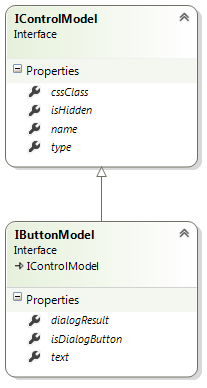
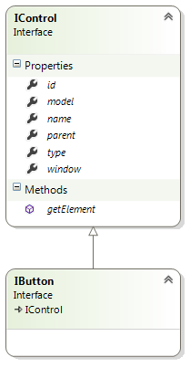

# Button Control


## Model



**type: string** - type of the control. Use _"button"_ to declare a Button control.

**name?: string** (optional) - name of the control. In javascript code, a child control is accessible from its parent control by name. In HTML, the value is put into the _name_ attribute of the element.

**cssClass?: string** (optional) - custom CSS class that will be applied to the control's outer element.

**isHidden?: boolean** (optional) - allows to declare control as hidden.

**text?: string** (optional) - button text.

**isDialogButton?: boolean** (optional) - allows to configure button as a dialog button. Dialog buttons are shown in the bottom section of the window and have a special behavior.

**dialogResult?: string** (optional) - used in case _isDialogButton_ is set to true. In this case, clicking the dialog button closes the window with the specified dialog result.

### Example

```javascript
{
	"name": "editButton",
	"type": "button",
	"text": "Edit"
}
```

## Control



**model: IControlModel** - reference to the model.

**id: string** - control id. Returns value of the _id_ attribute of the element.

**type: string** - type of the control.

**name: string** - name of the control.

**parent: IControl** - reference to the parent control.

**window: IWindow** - reference to the window that owns the control.

**getElement(): JQuery** - returns the HTML element that represents the control.