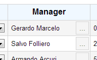

# GridView ObjectSelector Column



## Model


**type: string** - type of the control. Use _"gridviewobjectselectorcolumn"_ to declare an ObjectSelector column.

**name?: string** (optional) - name of the control. In javascript code, a child control is accessible from its parent control by name. In HTML, the value is put into the _name_ attribute of the element.

**cssClass?: string** (optional) - custom CSS class that will be applied to the control's outer element.

**isHidden?: boolean** (optional) - allows to declare control as hidden.

**bindsTo?: string** (optional) - path of the property that the control will be databound to.

**label?: string** (optional) - control label.

**isEditable?: boolean** (optional) - specifies whether the control allows manual editing of the value.

**width?: number** (optional) - column width.

**getObjectFunction?: string** (optional) - name of the function to get the object. The function has to be defined on redui.objectSources object.

**objectValueProperty?: string**(optional) - name of the property that is used as an object value (shown in the textbox). By default, the control looks for the property called "value".

### Example

```javascript
{
	"type": "gridviewobjectselectorcolumn",
	"name": "manager",
	"label": "Manager",
	"width": 120,
	"bindsTo": "manager",
	"getObjectFunction": "getManager",
	"objectValueProperty": "name"
}
```

## Control


**model: IControlModel** - reference to the model.

**id: string** - control id. Returns value of the _id_ attribute of the element.

**type: string** - type of the control.

**name: string** - name of the control.

**parent: IControl** - reference to the parent control.

**window: IWindow** - reference to the window that owns the control.

**getElement(): JQuery** - returns the HTML element that represents the control.