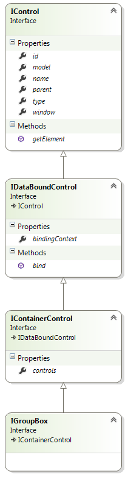

# GroupBox Control

## Model

**type: string** - type of the control. Use _"groupbox"_ to declare a GroupBox control.

**name?: string** (optional) - name of the control. In javascript code, a child control is accessible from its parent control by name. In HTML, the value is put into the _name_ attribute of the element.

**cssClass?: string** (optional) - custom CSS class that will be applied to the control's outer element.

**isHidden?: boolean** (optional) - allows to declare control as hidden.

**controls?: IControlModel** (optional) - describes child controls that GroupBox contains.

**bindingContext?: string** (optional) - property of the data object that will be used as a binding context. When not set, the data object itself is used as a context.

**label?: string** (optional) - control label.

### Example

{code:javascript}
{
	"name": "addressGroupBox",
	"type": "groupbox",
	"label": "Address",
	"controls": [
		{
			"name": "streetTextBox",
			"type": "textbox",
			"label": "Street",
			"bindsTo": "address.street"
		},
		{
			"name": "zipTextBox",
			"type": "textbox",
			"label": "Zip",
			"bindsTo": "address.zip"
		},
		{
			"name": "cityTextBox",
			"type": "textbox",
			"label": "City",
			"bindsTo": "address.city"
		}
	]
}
{code:javascript}

## Control

**model: IControlModel** - reference to the model.

**id: string** - control id. Returns value of the _id_ attribute of the element.

**type: string** - type of the control.

**name: string** - name of the control.

**parent: IControl** - reference to the parent control.

**window: IWindow** - reference to the window that owns the control.

**bindingContext: any** - reference to the object that the control is bound to.

**controls: IControl** - array of child controls.

**getElement(): JQuery** - returns the HTML element that represents the control.

**bind(dataObject: any): void** - binds the control to the data model.

[GroupBox Control Example](GroupBox-Control-Example)

.