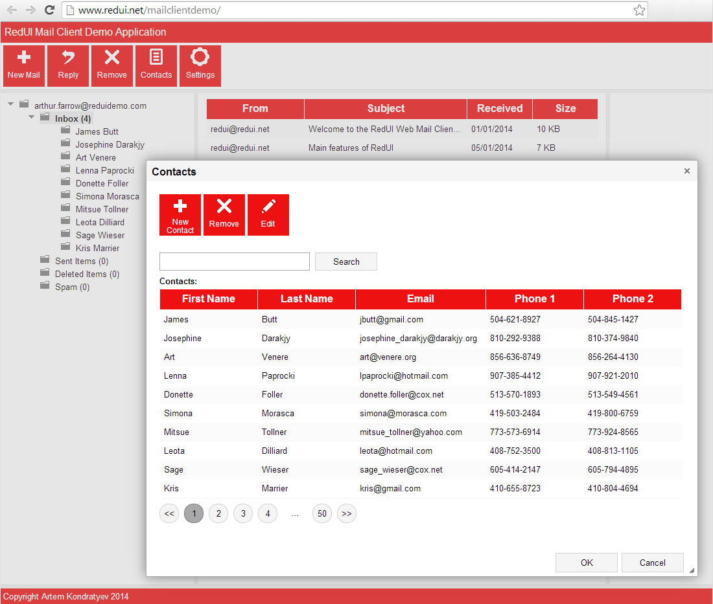

# Javascript UI Framework for Single Page Applications

**_[http://www.redui.net/](http://www.redui.net/)_**

**_Check [Demo application](http://www.redui.net/mailclientdemo/) to see how all controls work together_**

**_See [Live Examples](http://www.redui.net/examples/) for interactive examples._**

**_See the [Release Notes](Release-Notes) to check what's new._**

**_Or simply download [RedUI nuget package](https://www.nuget.org/packages/redui/) and try it out!_**

# Main features of RedUI library

* Declarative UI model
* Full set of ready-to-use controls to create enterprise application UI, including data grid view and tree view
* Easy and intuitive programming model
* 2-way data binding
* Built-in validation
* Localizable controls (leverages globalize.js w/o direct dependency)
* Supports observables (leverages knockout.js w/o direct dependency)
* Open to add custom controls

# Four Main Principles

## Stateful Event-Driven WindowsForms/WPF-like Client-Side UI

When Microsoft introduced ASP.NET it looked great because it tried to mimic the rich client stateful development model by saving the state between the requests in the ViewState and triggering events on the postback. But while it looked very much as the rich client model it didn't truly behave like one, and that's why the MVC was suggested as better, more web-friendly model thanks to the fact that it doesn't try to hide the stateless nature of the web. But despite the growing popularity of MVC frameworks, MVC is neither convenient nor natural pattern for building fully-blown reach UI, and good alignment with HTTP seem to be the only real, yet significant, benefit.

In the same time, improving capabilities of the modern browsers, client-side scripting languages and libraries are now allowing moving the UI logic completely to the client, reserving server calls only to obtain the data. This makes it possible to return to the truly stateful, event-driven development model.

## Declarative UI Model

Separating the UI model has proven to be of the great convenience for a developer and contributes largely to a success of the technologies like WPF, and products like MS Dynamics AX. While idea of splitting the work between UI designer and developer in reality never worked, having separate model makes it possible to build UI with aid of visual form designers, which simplifies a life of developer. What is more important, it standardizes the whole process by defining the limited set of available building blocks (textbox, gridview) with the pre-defined and unified behavior. For the same reason styles and themes can also be applied consistently and with much less effort.

## Data Binding

Since the whole UI is now created declaratively, the certain mechanism is required to fill the controls generated in runtime to the data retrieved from server. This mechanism is known as databinding.

## HTML Templates

The result of the UI generation from the declarative model should be predictable, transparent and customizable. All this is achieved by the use of HTML-templates. Every control type allowed in the UI model is mapped to the HTML template, which parameters are replaced with the values from the model at the time of the UI generation. This allows customizing process of HTML rendering, take full advantage of CSS to style the UI, and achieve more clarity in general.

**Follow the project on twitter:** [@redui_project](https://twitter.com/redui_project)

.