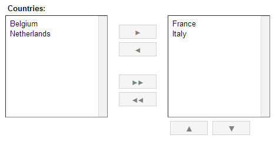
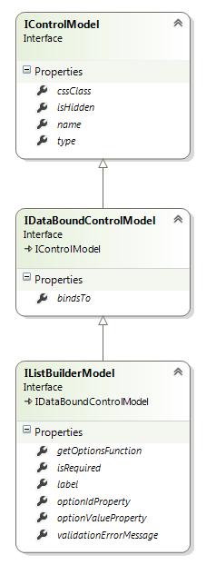
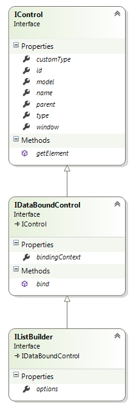

# ListBuilder Control



## Model



**type: string** - type of the control. Use _"listbuilder"_ to declare a ListBuilder control.

**name?: string** (optional) - name of the control. In javascript code, a child control is accessible from its parent control by name. In HTML, the value is put into the _name_ attribute of the element.

**cssClass?: string** (optional) - custom CSS class that will be applied to the control's outer element.

**isHidden?: boolean** (optional) - allows to declare control as hidden.

**bindsTo?: string** (optional) - path of the property that the control will be databound to.

**label?: string** (optional) - control label.

**getOptionsFunction?: string** (optional) - name of the function to get the possible values. The function has to be defined on redui.optionsBag object.

**optionIdProperty?: string** (optional) - name of the property that is used as a option id. In HTML, the value of this property is put into the _value_ attribute of the _option_ element. By default, the control looks for the property called "id".

**optionValueProperty?: string** (optional) - name of the property that is used as a option value. In HTML, the value of this property is put as an inner text of the _option_ element. If the value is not provided, the value returned by toString() function is used as value.

### Example

```javascript
{
	"name": "countriesListBuilder",
	"type": "listbuilder",
	"label": "Countries",
	"bindsTo": "countries",
	"getOptionsFunction": "getcountries"
}
```

## Control



**model: IControlModel** - reference to the model.

**id: string** - control id. Returns value of the _id_ attribute of the element.

**type: string** - type of the control.

**name: string** - name of the control.

**parent: IControl** - reference to the parent control.

**window: IWindow** - reference to the window that owns the control.

**bindingContext: any** - reference to the object that the control is bound to.

**options: any[]()** - reference to the array with the ListBuilder options.

**getElement(): JQuery** - returns the HTML element that represents the control.

**bind(dataObject: any): void** - binds the control to the data model.