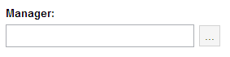
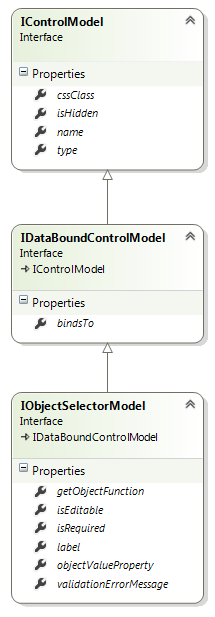

# ObjectSelector Control

## Model

**type: string** - type of the control. Use _"objectselector"_ to declare an ObjectSelector control.

**name?: string** (optional) - name of the control. In javascript code, a child control is accessible from its parent control by name. In HTML, the value is put into the _name_ attribute of the element.

**cssClass?: string** (optional) - custom CSS class that will be applied to the control's outer element.

**isHidden?: boolean** (optional) - allows to declare control as hidden.

**bindsTo?: string** (optional) - path of the property that the control will be databound to.

**label?: string** (optional) - control label.

**isEditable?: boolean** (optional) - specifies whether the control allows manual editing of the value.

**getObjectFunction?: string** (optional) - name of the function to get the object. The function has to be defined on redui.objectSources object.

**objectValueProperty?: string**(optional) - name of the property that is used as an object value (shown in the textbox). If the value is not provided, the value returned by toString() function is used as an object value.

### Example

{code:javascript}
{
	"name": "managerObjectSelector",
	"type": "objectselector",
	"label": "Manager",
	"bindsTo": "manager",
	"getObjectFunction": "getManager",
	"objectValueProperty": "name"
}
{code:javascript}

## Control

**model: IControlModel** - reference to the model.

**id: string** - control id. Returns value of the _id_ attribute of the element.

**type: string** - type of the control.

**name: string** - name of the control.

**parent: IControl** - reference to the parent control.

**window: IWindow** - reference to the window that owns the control.

**bindingContext: any** - reference to the object that the control is bound to.

**getElement(): JQuery** - returns the HTML element that represents the control.

**bind(dataObject: any): void** - binds the control to the data model.

[ObjectSelector Control Example With GridView](ObjectSelector-Control-Example.md)
[ObjectSelector Control Example With TreeView](ObjectSelector-Control-Example-With-TreeView.md)