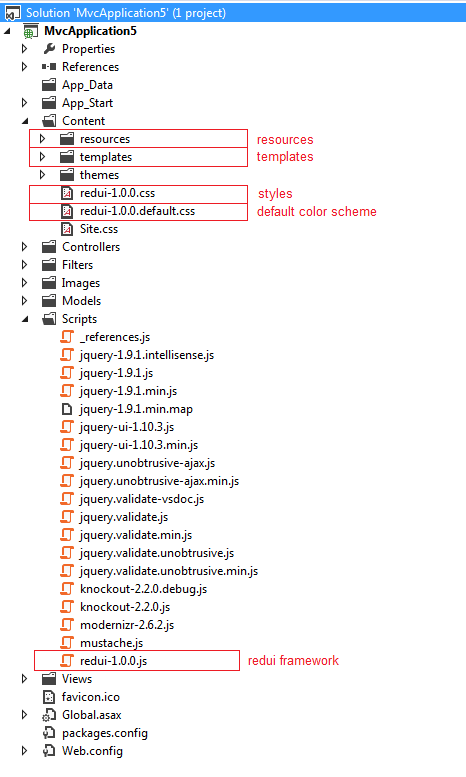
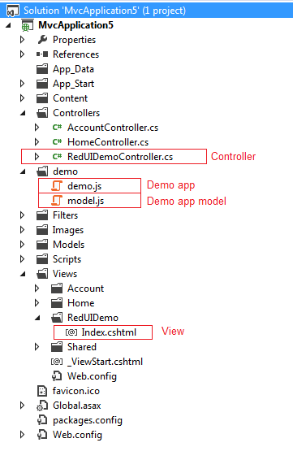

# RedUI Hello World

_This page explains how to create the simplest RedUI application._

## Prerequisites

### Create Project

_You need to create an MVC application in which you will be using RedUI._

For more details please refer to this page [http://msdn.microsoft.com/en-us/library/dd410597(v=vs.100).aspx](http://msdn.microsoft.com/en-us/library/dd410597(v=vs.100).aspx).

## Creating The First RedUI Application

### Install RedUI NuGet package

_The easiest way to start using RedUI is to install a RedUI [NuGet package](https://www.nuget.org/packages/redui/)._

Use the NuGet Visual Studio Extension or run the following command in the NuGet Package Manager Console:

{code:powershell}
PM> Install-Package redui -Pre
{code:powershell}

After the package is installed, you project structure should look like this:

### Create Model

_You need a model that will describe your application windows and drive the framework._

In the sub folder 'demo' of your web project, create a file model.js with the following content:

{code:javascript}
{
    "windows": [
        {
            "name": "CustomerDetails",
            "title": "Customer Details",
            "left": 50,
            "top": 50,
            "width": 600,
            "height": 600,
            "controls": [
                {
                    "name": "customerFirstNameTextBox",
                    "type": "textbox",
                    "label": "First Name",
                    "bindsTo": "firstName"
                },
                {
                    "name": "customerLastNameTextBox",
                    "type": "textbox",
                    "label": "Last Name",
                    "bindsTo": "lastName"
                },
                {
                    "name": "addressGroupBox",
                    "type": "groupbox",
                    "label": "Address",
                    "controls": [
                        {
                            "name": "streetTextBox",
                            "type": "textbox",
                            "label": "Street",
                            "bindsTo": "address.street"
                        },
                        {
                            "name": "zipTextBox",
                            "type": "textbox",
                            "label": "Zip",
                            "bindsTo": "address.zip"
                        },
                        {
                            "name": "cityTextBox",
                            "type": "textbox",
                            "label": "City",
                            "bindsTo": "address.city"
                        },
                        {
                            "name": "countryComboBox",
                            "type": "combobox",
                            "label": "Country",
                            "bindsTo": "address.country",
                            "getOptionsFunction": "getcountries"
                        }
                    ]
                },
                {
                    "name": "vipCheckBox",
                    "type": "checkbox",
                    "label": "VIP",
                    "bindsTo": "isVip"
                }
            ]
        }
    ]
}
{code:javascript}

### Create Application Code

_You need to write a piece of javascript code to create a window, bind it to the data and show it in the browser window._

In the sub folder 'demo' of your web project, create a file demo.js with the following content:

{code:javascript}
$(function () {

    // Countries to choose from, used as options for a country combobox
    var countries = [
        { id: "", value: "" },
        { id: "be", value: "Belgium" },
        { id: "fr", value: "France" },
        { id: "it", value: "Italy" },
        { id: "nl", value: "Netherlands" }
    ];

    // Function to retrieve countries used by combobox
    redui.optionsBag.getcountries = function () {
        return countries;
    };

    // Customer data
    var customerData = {
        id: 1,
        firstName: "Mario",
        lastName: "Pizzi",
        isVip: true,
        address: {
            street: "Via Roma",
            zip: 1000,
            city: "Torino",
            country: "it"
        }
    };

    // Create a new details window
    customerDetailsWindow = redui.createNewWindow("CustomerDetails");

    // Bind to the data
    customerDetailsWindow.bind(customerData);

    // Show the details window
    customerDetailsWindow.show();
});
{code:javascript}

### Create Controller

Add a simple controller that will return a default view.

{code:c#}
    public class RedUIDemoController : Controller
    {
        public ActionResult Index()
        {
            return View();
        }
    }
{code:c#}

### Create View

_Finally, you need a page that will be returned to the user._

Add a view that will be returned by one of the controllers, with the following content:

{code:html}
@{
    Layout = null;
}

<!DOCTYPE html>

<html>
<head>
    <meta name="viewport" content="width=device-width" />
    <title>RedUI Demo</title>

    <!-- Custom styles -->
    

    <!-- CSS for jquery UI -->
    <link href="http://ajax.googleapis.com/ajax/libs/jqueryui/1.10.0/themes/base/jquery-ui.css" rel="stylesheet" type="text/css"/>
    <!-- Default CSS for RedUI -->
    <link href="@Url.Content("~/Content/redui-1.0.0.css")" rel="stylesheet" type="text/css" />
    <!-- Default color scheme for RedUI -->
    <link href="@Url.Content("~/Content/redui-1.0.0.default.css")" rel="stylesheet" type="text/css" />
</head>
<body>
    <!-- This DIV is a container for the RedUI application.
        It has to have attribute id set to "redui_application"
        data-templatesbaseurl atribute contains url of the templates that will be used to render the UI
        data-model attribute contains url of the model -->
    

    <!-- Dependencies -->
    
    
    
    
    <!-- RedUI framework -->
    

    <!-- Demo app code -->
    
</body>
</html>
{code:html}

At this point your project should look like this:

## Results

As a result, you should get your first window rendered on the page:

