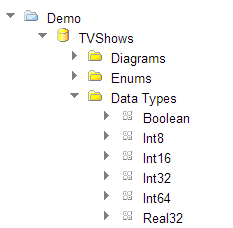
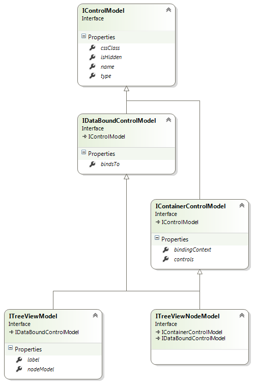
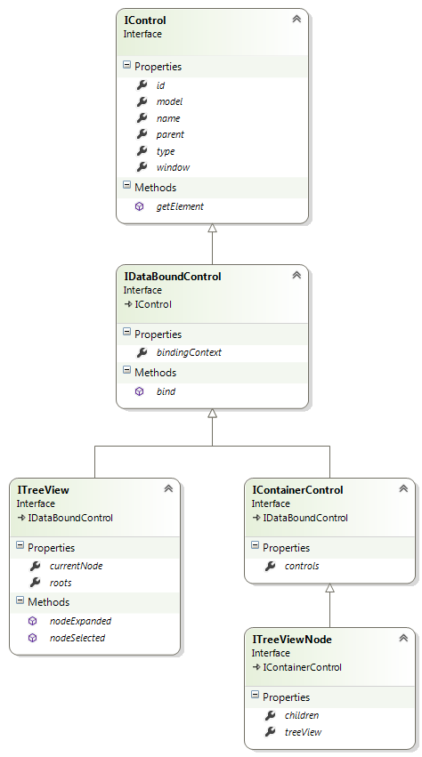

# TreeView Control



## Model



**type: string** - type of the control. Use _"gridview"_ to declare a GridView control.

**name?: string** (optional) - name of the control. In javascript code, a child control is accessible from its parent control by name. In HTML, the value is put into the _name_ attribute of the element.

**cssClass?: string** (optional) - custom CSS class that will be applied to the control's outer element.

**isHidden?: boolean** (optional) - allows to declare control as hidden.

**bindsTo?: string** (optional) - path of the property that the control will be databound to.

**controls?: IControlModel[]()** (optional) - describes child controls that GroupBox contains.

**bindingContext?: string** (optional) - property of the data object that will be used as a binding context. When not set, the data object itself is used as a context.

#### ITreeViewModel Properties

**label?: string** (optional) - control label.

**nodeModel: ITreeViewNodeModel** (optional) - describes a single tree node.

### Example

```javascript
{
	"name": "managersTree",
	"type": "treeview",
	"bindsTo": "items",
	"nodeModel": {
		"name": "managersTreeNode",
		"type": "treeviewnode",
		"bindsTo": "items",
		"controls": [
			{
				"name": "nodeIcon",
				"type": "image",
				"alternateText": "Icon",
				"width": 16,
				"height": 16,
				"source": "/demo/resources/user-admin.png"
			},
			{
				"name": "titleStaticText",
				"type": "statictext",
				"bindsTo": "title"
			},
			{
				"name": "nameStaticText",
				"type": "statictext",
				"bindsTo": "name"
			}
		]
	}
}
```

## Control



**model: IControlModel** - reference to the model.

**id: string** - control id. Returns value of the _id_ attribute of the element.

**type: string** - type of the control.

**name: string** - name of the control.

**parent: IControl** - reference to the parent control.

**window: IWindow** - reference to the window that owns the control.

**bindingContext: any** - reference to the object that the control is bound to.

**getElement(): JQuery** - returns the HTML element that represents the control.

**bind(dataObject: any): void** - binds the control to the data model.

#### ITreeView Properties And Methods

**roots: ITreeViewNode[]()** - array of root nodes of the tree view.

**currentNode: ITreeViewNode** - reference to the current node.

**nodeSelected(handler: (target: any, node: ITreeViewNode) => void): void** - subscribes a handler to the event that is triggered when the node is selected.

**nodeExpanded(handler: (target: any, node: ITreeViewNode) => void): void** - subscribes a handler to the event that is triggered when the node is expanded.

#### ITreeViewNode Properties And Methods

**controls: IControl[]()** - array of child controls.

**children: ITreeViewNode[]()** - array of child nodes.

**treeView: ITreeView** - reference to the tree view.